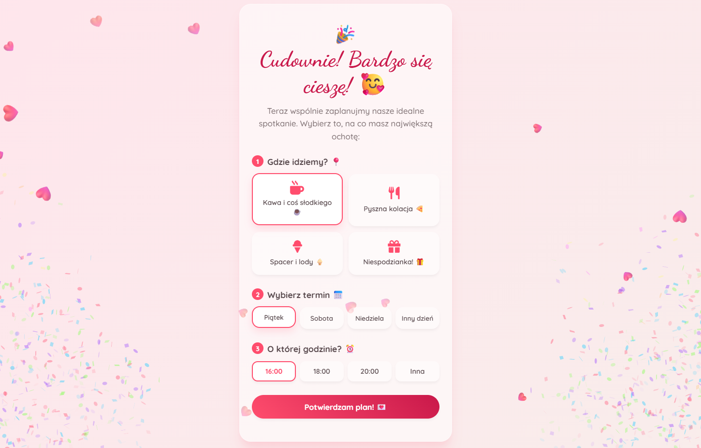

# 💖 I Have a Question For You – Interactive Date Invitation

  

I Have a Question For You is a simple, cute Single Page Application (SPA) designed to ask someone out on a date in a charming way. The app guides the user through a few screens, playfully dodges the "NO" button, and allows them to generate a date plan that can be easily shared via WhatsApp or SMS.

## 🛠️ Tech Stack
- **Frontend:** Vanilla HTML5, CSS3, JavaScript ES6+
- **Fonts:** Google Fonts (Dancing Script, Quicksand)
- **Icons:** FontAwesome
- **Extras:** Canvas Confetti

## 🚀 How to Run Locally
1. Clone the repository or download the folder.
2. Open `index.html` in your browser. (No build step required!)

## ✏️ Customization
Edit `index.html` to update texts, titles, or questions according to your preferences. Date options (like activities, days, and times) can be easily modified within the `<form id="date-planner-form">` section. Colors and styles can be tweaked in `style.css`.
