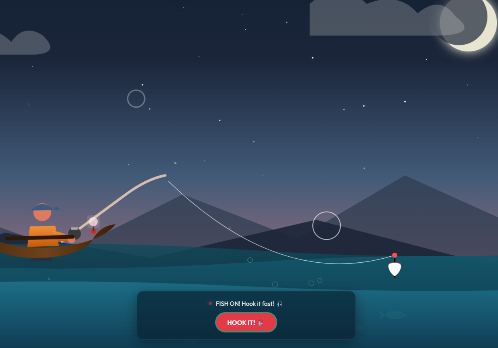

# 🎣 Catch My CV – Interactive Fishing Portfolio

**Catch My CV** is an interactive web portfolio styled as a calm night-time fishing trip. Cast a line, catch some funny loot, and pull out a fully unrollable parchment CV!

## 🛠️ Tech Stack
- **Frontend:** Vanilla HTML5, CSS3, JavaScript ES6+
- **Audio:** Web Audio API (100% synthesized sound)
- **Graphics:** SVG Vectors

## 🚀 How to Run Locally
1. Clone the repository.
2. Open `index.html` in your browser. (No build step required!)

## ✏️ Customization
Edit `index.html` (inside `<article id="cv-parchment">`) to update your personal details, experience, and skills. Colors can be tweaked in `style.css`.
