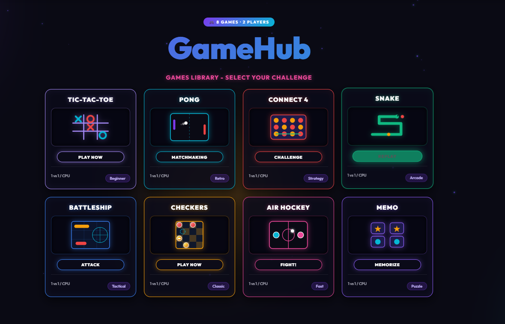

# 🎮 GameHub – 8 Arcade & Strategy Games for 2 Players


[](https://mygamesproject.netlify.app/)

GameHub is an interactive web application featuring 8 classic arcade and strategy games designed for local 2-player matches or single-player versus AI. Challenge a friend or test your skills against smart computer brawlers in a sleek dark neon glassmorphism environment with 100% Web Audio API synthesized retro sound, responsive controls, customizable player avatars, unlockable achievements, and built-in interactive tutorials!

> 🌐 **Live Demo**: [https://mygamesproject.netlify.app/](https://mygamesproject.netlify.app/)

---

## 📸 App Preview



---

## 🛠️ Tech Stack

- **Frontend**: Vanilla HTML5, CSS3 (CSS Variables, Flexbox, CSS Grid & Dynamic Canvas), JavaScript ES6+
- **Audio**: Web Audio API (100% pure real-time retro sound synthesis)
- **Graphics**: SVG Vectors, Dynamic Canvas Renderers, Cyber Dust Particles & Glassmorphism Aesthetics
- **Build Tool**: Vite (optional, zero-dependency required to run directly!)

---

## 🌐 How to Deploy to Netlify

### Option 1: Netlify Drag & Drop (Fastest - 10 Seconds ⚡)
1. Run `npm run build` locally.
2. Go to [app.netlify.com/drop](https://app.netlify.com/drop).
3. Drag & drop the **`dist`** folder into the Netlify window.
4. Your GameHub app is instantly live online!

### Option 2: Automatic Git Deployment (GitHub / GitLab / Bitbucket)
1. Push this repository to GitHub.
2. Log in to Netlify, click **"Add new site"** -> **"Import an existing project"**.
3. Select your repository.
4. Netlify will automatically detect `netlify.toml` and configure:
   - **Build Command**: `npm run build`
   - **Publish Directory**: `dist`
5. Click **"Deploy GameHub"**!

---

## 🚀 How to Run Locally

1. **Clone the repository**:
   ```bash
   git clone https://github.com/your-username/gamehub.git
   cd gamehub
   ```
2. **Open directly in browser** (No build step required!):
   Open `index.html` in your browser.
3. **Or run with Vite Dev Server**:
   ```bash
   npm install
   npm run dev
   ```

---

## ✏️ Customization

- **Edit Games & AI Logic**: Modify game mechanics, win thresholds, and CPU algorithms in `script.js`.
- **Edit Aesthetics & Color Schemes**: Tweak neon theme colors, CSS variables, gradients, and glassmorphism styles in `style.css`.
- **Edit Rules & Interactive Tutorials**: Customize rules, key chips, and pro-tips inside `script.js` or inside `#rules-modal` in `index.html`.

---

## 🕹️ Included Games & Features

- ⭕ **Tic-Tac-Toe** – Turn-based 3x3 logic match with Minimax AI.
- 🏓 **Pong ⚡** – Dynamic pong match with particle trails & power-ups.
- 🔴 **Connect 4** – 4-in-a-row drop match with gravity physics.
- 🐍 **Snake (2-Player Battle)** – 2-player snake arena with apples, stars, speed boosts & shields.
- ⚓ **Battleship** – Hotseat naval warfare with auto-placement & privacy overlay.
- ♟️ **Checkers** – Traditional 8x8 checkers with forced captures & promoted Kings.
- 🏒 **Air Hockey** – Ultra-fast physics ice hockey table.
- 🃏 **Memo** – Memory emoji card matching game with smart CPU memory AI.

