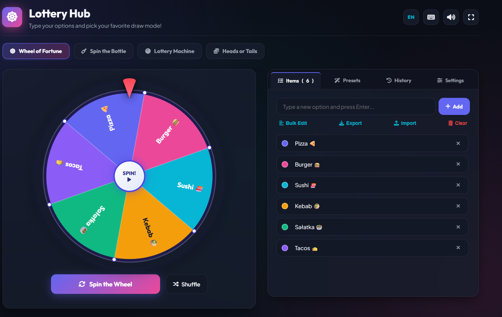

# 🎡 Lottery Hub – Interactive Decision & Draw Platform

**Lottery Hub** is a modern, interactive web platform featuring 4 engaging decision modes: **Wheel of Fortune**, **Spin the Bottle**, **Lottery Machine (Bouncing Balls)**, and **3D Heads or Tails**. Powered by Web Audio API sound synthesis, canvas confetti, voice narration, statistics, and full customization!

---

## 📸 App Overview

> Interactive interface with dynamic color themes, physics animations, audio effects, and multi-language support (English & Polish).

---

## ✨ Features

- 🎯 **4 Draw Modes**:
  - 🎡 **Wheel of Fortune** – Smooth spinning wheel with a dynamic bouncing pointer and custom color palettes.
  - 🍾 **Spin the Bottle** – Interactive 3D bottle rotating around circularly arranged options.
  - 🎱 **Lottery Machine** – Physics simulation of a glass drum with bouncing lottery balls.
  - 🪙 **Heads or Tails** – 3D coin flip with realistic rotation and landing physics.
- 🎨 **Color Themes**: Vivid & Rainbow, Cyberpunk Neon, Subtle Pastel, Gold & Elegance.
- 🌐 **Bilingual (EN / PL)**: Instant one-click language switching across the entire UI.
- 🔊 **Synthesized Audio & Voice Narrator**: Pure sound effects generated programmatically with the **Web Audio API** (no external audio files!) plus built-in Speech Synthesis API voice narration.
- 🎆 **Celebration Effects**: Canvas-based particle confetti system launched on every win.
- ⌨️ **Keyboard Shortcuts**:
  - `Space` / `Enter` – Instantly trigger a draw in the active mode.
  - `Esc` – Quickly close any modal or winner dialog.
- 📥 **JSON Export & Import**: Save your custom lists to `.json` files and reload them anytime.
- 📊 **History & Statistics**: Track win frequencies for each item and review recent draw history.
- 📱 **100% Fully Responsive**: Optimized for desktop, tablets, and smartphones.

---

## 🛠️ Tech Stack

- **Frontend**: Vanilla HTML5, CSS3 (Glassmorphism & Custom CSS Properties), JavaScript ES6+
- **Audio**: Web Audio API (100% synthesized sound via code, zero external mp3/wav assets)
- **Speech Synthesis**: Web Speech API (Built-in voice narrator reading the winner out loud)
- **Graphics**: HTML5 2D Canvas Context (High-DPI sharp rendering) & Pure CSS 3D Transforms

---

## 🚀 How to Run Locally

1. Clone or download this repository to your computer.
2. Open `index.html` in any modern web browser (Chrome, Firefox, Edge, Safari).
3. **That's it!** No Node.js, build tools, or server required! (`No build step required!`)

---

## ✏️ Customization

- **Edit Items**: Type options directly in the sidebar panel, use the bulk text editor, or select from built-in presets (Lunch, Yes/No, Truth or Dare, etc.).
- **Export/Import**: Save your custom list of items to a `.json` file in the **Items** tab and reload it anytime.
- **Tweak Appearance**: Customize spin duration and color themes in the **Settings** tab.

---

  Crafted with passion using Vanilla JS! 🚀

